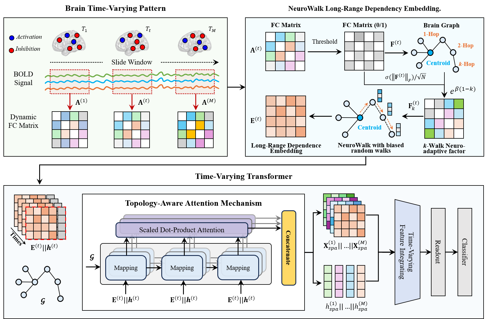

<div align="center">
<h2>Adaptive Embedding for Long-Range High-Order Dependencies via Time-Varying Transformer on fMRI</h2>

<p align="center">
  <b>Rundong Xue, Xiangmin Han<sup>*</sup>, Hao Hu, Zeyu Zhang, Shaoyi Du<sup>*</sup>, Yue Gao</b>
</p>

Accepted by _**MICCAI 2025**_

[[Paper]](https://papers.miccai.org/miccai-2025/paper/0949_paper.pdf)

</div>

## Overview
<div align="center">
    
</div>


**Figure 1. The framework of the proposed LHDFormer.**


**_Abstract -_** Dynamic functional brain network analysis using rs-fMRI has emerged as a powerful approach to understanding brain disorders. However, current methods predominantly focus on pairwise brain region interactions, neglecting critical high-order dependencies and time-varying communication mechanisms. To address these limitations, we propose the Long-Range High-Order Dependency Transformer (LHDFormer), a neurophysiologically-inspired framework that integrates multiscale long-range dependencies with time-varying connectivity patterns. Specifically, we present a biased random walk sampling strategy with NeuroWalk kernel-guided transfer probabilities that dynamically simulate multi-step information loss through a $k$-walk neuroadaptive factor, modeling brain neurobiological principles such as distance-dependent information loss and state-dependent pathway modulation. This enables the adaptive capture of the multi-scale short-range couplings and long-range high-order dependencies corresponding to different steps across evolving connectivity patterns. Complementing this, the time-varying transformer co-embeds local spatial configurations via topology-aware attention and global temporal dynamics through cross-window token guidance, overcoming the single-domain bias of conventional graph/transformer methods. Extensive experiments on ABIDE and ADNI datasets demonstrate that LHDFormer outperforms state-of-the-art methods in brain disease diagnosis. Crucially, the model identifies interpretable high-order connectivity signatures, revealing disrupted long-range integration patterns in patients that align with known neuropathological mechanisms.

## Dependencies

  - python=3.9
  - cudatoolkit=11.3
  - torchvision=0.13.1
  - pytorch=1.12.1
  - torchaudio=0.12.1
  - wandb=0.13.1
  - scikit-learn=1.1.1
  - pandas=1.4.3
  - hydra-core=1.2.0

## Get Started
### 1. Data Preparation
Download the ABIDE dataset from [here](https://drive.google.com/file/d/14UGsikYH_SQ-d_GvY2Um2oEHw3WNxDY3/view?usp=sharing).

### 2. Usage
Run the following command to train the model.
```bash
sh main.sh
```

## Cite our work
```bibtex
@inproceedings{xue2025adaptive,
  title = {Adaptive Embedding for Long-Range High-Order Dependencies via Time-Varying Transformer on fMRI},
  author = {Xue, Rundong and Han, Xiangmin and Hu, Hao and Zhang, Zeyu and Du, Shaoyi and Gao, Yue},
  booktitle = {International Conference on Medical Image Computing and Computer-Assisted Intervention},
  year = {2025},
}
```

## License
The source code is free for research and educational use only. Any commercial use should get formal permission first.

This repo benefits from [BNT](https://github.com/Wayfear/BrainNetworkTransformer) and [ALTER](https://github.com/yushuowiki/ALTER). Thanks for their wonderful works.
